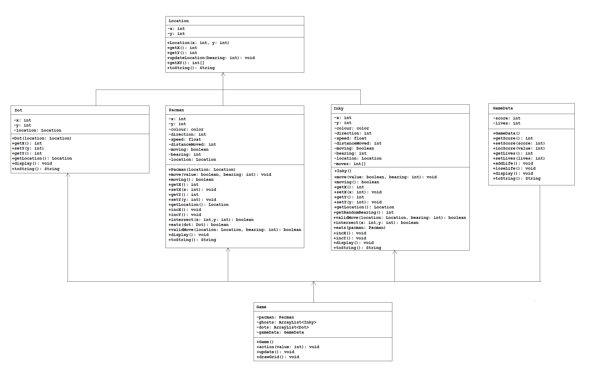
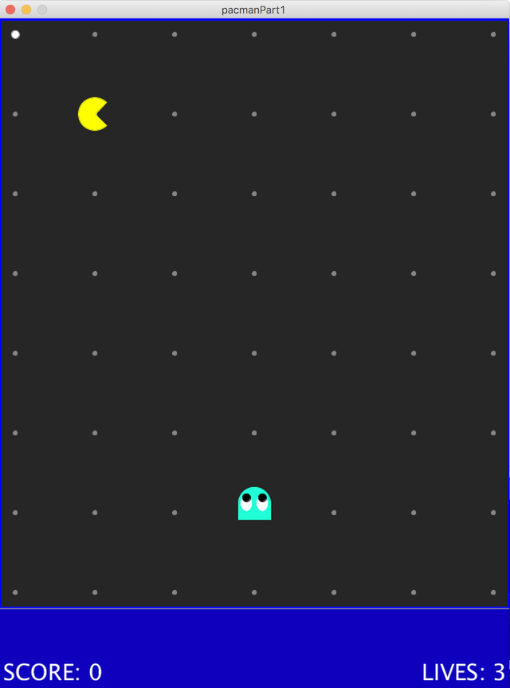
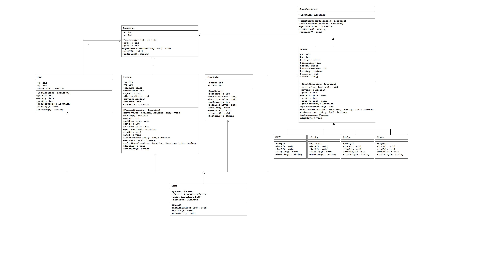

# Assignment 4 - Pacman

## Contents

- [Part 1](#part-1--gamedata-arraylists-etc) []
- [Part 2](#part-2---ghost--gamecharacter-abstract-class) []
- [Part 3](#part-3---invalidlocationexception--edible) []
- [Part 4](#part-4---energizer-scores--lives) []


## Submission Details

The deadline for electronic submissions is noon Friday 23rd December 2022.  Submit your code via the link on BlackBoard.

Submit your [Assignment Cover Sheet](resources/2023oopa4Coversheet.docx) during any lecture before the end of semester.


**A note on plagiarism and cheating**

If any of the code submitted by you is deemed copied from or by someone else it will be formally 
reported to the Head of School of Science and a Disciplinary Committee will be convened to deal with this issue.  You do not want that to happen!!

Never copy code from someone else or another source. Never give your code to someone else. Keep your
code safely in your own possession. Plagiarism and cheating are very serious academic offenses
with serious consequences for your future academic studies and work opportunities. Under
current guidelines all students involved in plagiarism or cheating must be reported to the Head
of School where a Disciplinary Committee will deal with the issue.

## Introduction

Note: For each part you should have separate folders (``pacmanPart1``, ``pacmanPart2``, etc). 
Some of the classes you create in one part may be copied into another (and perhaps modified for the purposes of that part).


## Part 1 – GameData, ArrayLists, etc

Get the project folder ``pacmanPart1`` [here](resources/pacmanPart1.zip). 


**Follow the instructions below precisely**.  Any deviation from this will mean you could lose marks.

[This](images/classDiagramA.png) class diagram shown below shows the structure of this part of the assignment when completed.



Run the Pacman game.  



You'll see a *Pacman* near the top of the screen, a *Dot* at the top left, and a ghost called *Inky* moving around the bottom of the screen.  Take some time to **examine and understand this code thoroughly**.  


1.	Examine the ``GameData`` class in the diagram shown above.  It contains:

	-	2 private instance variables - ``score`` and ``lives``
	-	a default constructor that initialises those variables
	-	7 getter, setter and incrementer methods 
	-	a ``display()`` method
	-	a ``toString()`` method that should return data in this format - [GameData:score=0;lives=3]

	Write the missing code for the getters, setters, incrementers and ``toString()``.

	Test your solution by uncommenting the following tester code in the project `setup()` method:

	```java
	GameData gameData = new GameData();
	println(gameData);
	gameData.setScore(500);
	gameData.incScore(10);
	println("score="+gameData.getScore());
	gameData.setLives(3);
	gameData.addLife();
	gameData.addLife();
	gameData.loseLife();
	println("lives="+gameData.getLives());
	println(gameData);

	```

	It should print:

	```text
    [GameData:score=0, lives=3]
	score=510
	lives=4
	[GameData:score=510, lives=4]

	```

	Make sure it prints this using the tester code provided.  Marks are lost if you don't pay attention to detail including brackets, commas, spaces, etc.

1.	Provide the appropriate ``toString()`` methods shown for the other classes in the diagram.  The following are examples of the output expected:

	```
	[Pacman:location=[Location:(1,1)], direction=1, speed=2.0, moving=false, bearing=1]
	[Inky:location=[Location:(3,6)], direction=1, speed=2.0, moving=false, bearing=1]
	[Dot:location=[Location:(1,0)], x=100, y=0]
	[Location:(1,1)]

	```

	Again, pay attention to detail shown here.

1.  In the game so far there is only one ghost (i.e. Inky) being rendered. We'll modify the ``Game`` class so an arraylist of 4 Inky ghosts can be displayed.  We will:
    -   create an arraylist ``ghosts`` for `Inky` objects
    -   add 4 `Inky` ghost objects to the arraylist
    -   display & move the ghosts
    -   check if any ghost eats the pacman

    a.	First, in ``Game`` comment out (remove) the `inky` object *declaration* and add an arraylist *declaration* for `ghosts` like this:

    ```java
	// private Inky inky;
	private ArrayList<Inky> ghosts;

    ```

    b.   In ``Game()`` comment out the code that creates the single `inky` object and replace it with code to *create* the ``ghosts`` arraylist 

    c.   Next, add four *inky* objects to the new arraylist ``ghosts``, e.g. use 4 of these:

	```java
	new Inky(new Location(3, 6))
	
	```

	The four ghosts will all initially appear at the same location (3,6).
    
	d.   In ``update()`` comment out the code that displays and moves a single inky ghost and add code that displays all ghost objects.  Use an enhanced for loop.
    
	e.   At the end of ``update()`` change the code to check if any ghost in the ``ghosts`` arraylist eats the Pacman.

    When completed you should have 4 inky ghosts appearing in the game.  When any ghost collides with (eats) Pacman the game should end.

1.  You'll have noticed that there is only one *Dot* at the top left of the screen.  In `Game()` where the dot is created, update the code so dots are drawn in all 56 locations on the screen.  You must use a for loop in your solution to add these dots.

1.  When a Pacman eats a Dot, briefly change the background color of the screen to yellow.  You should see a yellow flash at the moment the Pacman eats a Dot.

1.	The Pacman is moved left, right, up & down using the keys 'a', 's', 'p', & 'l' respectively.  As well as using these keys update the code so the keyboard arrow keys can be used to control the Pacman too.  Use the documentation [here](https://processing.org/reference/keyCode.html) to help you.

1.	You should have noticed how the ghosts never leave/disappear from the game screen.  The same is not true for the Pacman.  Try moving the Pacman off the game grid.  You must not allow this to happen.  In `action()` add one line of code that uses the `Pacman` `validMove()` method in your solution.

1.  In the ``GameData`` class we saw the ``lives`` variable set to 3 using ``Game.INITIAL_LIVES``.
    In the ``GameData`` method ``display()`` write the code to draw the correct number of miniture Pacmans as shown here for 3 lives:

    

	Note: when you have 3 lives there are 2 Pacman in the game data area and 1 in the game grid.

	Also, make sure you are displaying the correct text for the Score and Lives. 


## Part 2 - Ghost & GameCharacter abstract class

Only begin this part when you have completed or attempted all you can of *Part 1*.  

Make a copy of your ``pacmanPart1`` project folder, paste and rename it ``pacmanPart2``.  Use ``pacmanPart2`` for this part of the assignment.  You will need to rename the tester program for this part to ``pacmanPart2``.

1.	You will create a new class called ``GameCharacter`` as shown in [this](images/classDiagramB.png) class diagram below:

	

	It contains:

	-	1 private instance variable - ``Location``
	-	an overloaded constructor that initialises the class ``location`` object with the specific value passed as argument
	-	2 getter and setter methods 
	-	a ``toString()`` method that returns a string using this format:
	
	```
	[GameCharacter:location=[Location:(1,1)]]
	```

	a.	Write the missing code for the constructors, getters, setters and ``toString()``. 

	b.	Test your solution by uncommenting the following tester code in the project `setup()` method:

	```java
	println();
	println();
  	GameCharacter character = new GameCharacter(new Location(5,5));
  	println(character);
  	character.setLocation(new Location(6,6));
  	println(character);
  	println(character.getLocation());

	```

	It should print:

	```java
	[GameCharacter:location=[Location:(5,5)]]
	[GameCharacter:location=[Location:(6,6)]]

	```

	Make sure it prints this using the tester code provided.  Again, pay attention to the detail.

1.	Make the ``GameCharacter`` class ``abstract``.  The code in the project ``setup()`` method will need to be commented out again.

1.	Add the abstract method ``display()`` to ``GameCharacter``:

	```java
	public abstract void display();

	```

1.	Next, let's create a class ``Ghost`` that will be the parent class for ``Inky``.  View the overall structure shown in the [class diagram](images/classDiagramB.png).

	Create a new class ``Ghost`` using the code given [here](./Ghost.java).  Examine the code to get an idea of it's content.

1.	Many of the variables and methods already seen in ``Inky`` are now in the new ``Ghost`` class.  In ``Inky`` we can remove:

	a.	all the class variables - ``x``, ``y``, etc. 

	b.	the methods - ``move()``, ``moving()``, ``setX()``, ``getX()``, ``setY()``, ``getY()``, ``getLocation()()``, ``getRandomBearing()``, ``validMove()``, ``intersect()``, and ``eats()`` 

	Once these variables and methods are removed a number of compile errors will emerge.  We will fix those next.

1.	We've already mentioned that ``Inky`` will become a child class of the new ``Ghost`` class.  
	Update the code in ``Inky`` so that it inherits from ``Ghost``.  This will fix alot of the compile errors.

1.	In the constructor for ``Inky`` call the appropriate overloaded constructor from ``Ghost`` to initialise the ``location`` variable.  And remove the line:
	```java
	this.location=location;

	```

	Finally, you *may* need to fix an error in the ``toString()`` method in ``Inky``.  Make the appropriate code adjustment.

	If you've got this far you should now have implemented a number of classes that demonstrate inheritance in action.  Take a moment to understand what you've done here.  We will add more classes to this hierarchy next.
	
1.	Let's add 3 new classes for the ghosts - ``Blinky``, ``Pinky`` and ``Clyde``.  Along with ``Inky`` these ghosts complete the four members of the ghost team.

	a.	Create a new tab for the ``Blinky`` class.  From the ``Inky`` code tab copy all the code there and paste into the ``Blinky`` code tab.   

	b.	With a few changes you can use this code for ``Blinky``.  Change any mention of Inky to Blinky and change the colour of Blinky to red.

	c.	Repeat this for ``Pinky`` and ``Clyde``.

1.	Now that you have the four ghosts, make the necessary change to display these four ghosts, and NOT four Inky ghosts.  This will require you to change the data type of the ``ghosts`` arraylist and make other code amendments.


## Part 3 - InvalidLocationException & Edible

Only begin this part when you have completed or attempted all you can of *Part 2*.  

Make a copy of your ``pacmanPart2`` project folder, paste and rename it ``pacmanPart3``.  Use ``pacmanPart3`` for this part of the assignment.  You will need to rename the tester program for this part to ``pacmanPart3``.

### InvalidLocationException

1.	Create a class called ``InvalidLocationException``.  See the Java Doc file [here](https://lyitbb.blackboard.com/bbcswebdav/courses/OOPR_IT603_2023_CL/InvalidLocationException.html). (You may need to login to BB)
	**You MUST create the class exactly as required in the Java documentation given**.  Pay attention to inheritance, constructors and methods in this class.

1.	You should have noticed that the game characters  are placed in locations within the game grid.  Specifically any location from [0,0] to [6,7]. Format is [column,row]

	Modify the appropriate constructor in ``Location`` to throw an ``InvalidLocationException`` if an invalid location row or column number is passed to the constructor.  When throwing the exception the message displayed needs to be specific, for example:

	```
	Column 10 is an invalid location
	OR
	Row -2 is an invalid location
	etc.
	```
	
	These changes will cause errors in the ``Game`` class.  Fix them by using appropriate ``try..catch`` statements using the new exception.  Print the message returned by the exception class **and** stop the program by using the ``exit()`` method.  Therefore, if an invalid location number is given for any game character the game should stop.

### Edible Interface

Here we're going to use an interface to help make the Pacman edible or not.  If the Pacman is edible ghosts can eat it.  If Pacman is not edible ghosts cannot eat it.  Note: Our Pacman will never eat ghosts.

This code solution will require a moderate amount of independent work by you.

1.	Before creating our interface make the following preparatory change to the `Pacman` class.  Create a new class boolean variable called ``edible`` and initialise it to ``true``.  This variable will determine if the Pacman is edible or not to ghosts.  By default Pacman is edible.

1.	Create an interface called ``Edible`` See the Java Doc file [here](https://lyitbb.blackboard.com/bbcswebdav/courses/OOPR_IT603_2023_CL/Edible.html)

1.	Provide the appropriate implementation of ``Edible`` in the ``Pacman`` class.

1.	The value returned by the ``isEdible()`` method will determine if the Pacman can be eaten by ghosts or not.
	Update the code in ``Game`` to use the new ``isEdible()`` method **before** checking if a ghost has eaten the Pacman.  
	If Pacman is not edible do not check if any ghost has eaten it.


## Part 4 –  Energizer, Scores & Lives

Only begin this part when you have completed or attempted all you can of Part 3.

Make a copy of your ``pacmanPart3`` project folder, paste and rename it ``pacmanPart4``. Use ``pacmanPart4`` for this part of the assignment. You will need to rename the tester program for this part to ``pacmanPart4``.

This code solution will require more independent work by you.

1.	Create a new class called ``Energizer`` as shown in the [class diagram](images/classDiagramC.png).  Use/copy the ``display()`` code in ``Dot`` to help implement the code solution for ``Energizer``.  The Energizer is a special green dot.  If eaten by Pacman means Pacman becomes inedible by ghosts indefinitely.  You must implement the following functionality for the Energizer:

	a.	create an instance of `Energizer` in the `Game` class
	
	b.	should use a green colour
	
	c.	display at location (3,6)

	d.	if Pacman eats it:
		i.	you should see a green flash at the moment the Pacman eats it
		ii.	Pacman becomes inedible to ghosts
		iii.the ghosts change colour to blue		
		iv.	the score for eating `Dots` is doubled.  (more on scoring next)

1.	You need to update and display a score whilst playing the game.  Scores are awarded for eating Dots:

	| Event                          | Score |
	| ------------------------------ | ----- |
	| Eat Dot                        |  10   |
	| Eat Energizer                  |  100  |
	| Eat Dot after eating Energizer |  20   |

	You MUST use the ``GameData`` class ``display()`` method to display score.

1.	You will lose one life in the game each time Pacman is eaten.  Modify the code to implement this feature and each time it happens redisplay Pacman at location (1,1).

1.	Finally, the game should end immediately Pacman has 0 (zero) lives.

<!-- ## Part 6 – Sound -->